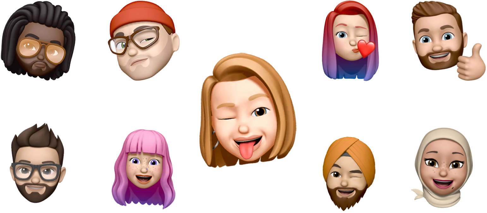

## MemojiView


----
<div>
<br>
<div align="center">

</div>

Since there is no official API for using the users Memoji's i have built a simple view to retrieve them and use them to your liking.

MemojiView works by having a TextView behind the actual View for user input. The passed string is converted to an image and displayed in the view.
That could also lead that users input character or emoji's with will also be converted to images.
Either conform to the delegate and display a warning if the users selects anything than a memoji or simply accepts any kind of input.

### Quick start
<br>
<div style="display: flex; align-items: center; margin-inline: 10%">
  
  <div style="width:40%;height:100px;"></div>
  
</div>

###### MemojiView

```swift
let memojiView = MemojiView(frame: .zero)
memojiView.tintColor = .purple

self.view.addSubview(memojiView)   
```


###### Delegate

To respond to changes of the image, implement the `MemojiViewDelegate` protocol in your class, e.g. a View Controller, and then set the views `delegate` property:

```swift
class MyViewController: UIViewController, MemojiViewDelegate {
  override func viewDidLoad() {
    super.viewDidLoad()

    let memojiView = MemojiView(frame: .zero)
    memojiView.delegate = self
  }

  // MemojiView delegate
 func didUpdateImage(image: UIImage, type: ImageType) {
    // Do something with the image or check the type of the image and respond accordingly.
 }
}
```

Or use the Closure for processing the image:

```swift        
memojiView.onChange = { image, imageType in
    // Do something on image change   
}
```

### Demo
<div align="center">

</div>

#### Text input
Like previously stated we can't really control the keyboard and therefore the input of the user.
Simply changing the Keyboard type will lead to different results. Using the default Character Keyboard will also convert them to images.
<div align="center">

</div>


### Requirements
- Xcode 11
- iOS 12 or later
- Swift 5 or later


### Installation

##### CocoaPods

You can use CocoaPods to install MemojiView by adding it to your Podfile:

    pod 'MemojiView'

##### Installing MemojiView manually
1. Download MemojiView.zip from the last release and extract its content in your project's folder.
2. From the Xcode project, choose Add Files to ... from the File menu and add the extracted files.

### Contribute
Contributions are highly appreciated! To submit one:
1. Fork
2. Commit changes to a branch in your fork
3. Push your code and make a pull request

</div>
